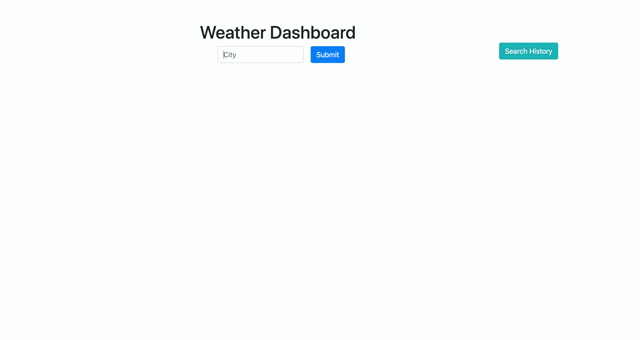

<!-- Top -->
<h1 align='center'>Weather Forcast Dashboard</h1>
<h2>💡 Project Overview</h2>
<p>Build a weather dashboard that will run in the browser and feature dynamically updated HTML and CSS.Using the [OpenWeather API](https://openweathermap.org/api) to retrieve weather data for cities. The documentation includes a section called "How to start" that will provide basic setup and usage instructions. We will use `localStorage` to store any persistent data.
<a href='https://juanlajara.github.io/Weather-Dashboard-via-APIs/' target='_blank'>Live Link</a>

</p>

<h2> ✨User Story</h2>

```
AS A traveler
I WANT to see the weather outlook for multiple cities
SO THAT I can plan a trip accordingly
```

<h2>⚙️ List of Technologies Used</h2>
<ul>
    <li>HTML</li>
    <li>CSS</li>
    <li>BootStrap</li>
    <li>JavaScript</li>
    <li>JQuery</li>
    <li>Ajax</li>
    <li>Font Awesome</li>

</ul>
<h2>📓 Contributor(s)</h2>
<div>🔭 Dre Lajara </div>
    <li><a href='https://github.com/juanlajara/juanlajara.github.io' target='_blank'>GitHub</a></li>
    <li><a href='https://www.linkedin.com/in/juan-andres-lajara-179a8442' target='_blank'>LinkedIn</a></li>
    <li>juanlajara001@gmail.com</li>
</ul>
<h2>💡 Special Thanks</h2>
<ul>
    <li>Kevin Holder</li>
</ul>

<h2>⚓ Acceptance Criteria</h2>

<p>

- GIVEN a weather dashboard with form inputs
- WHEN I search for a city
- THEN I am presented with current and future conditions for that city and that city is added to the search history

- WHEN I view current weather conditions for that city
- THEN I am presented with the city name, the date, an icon - representation of weather conditions, the temperature, the humidity, the wind speed, and the UV index

- WHEN I view the UV index
- THEN I am presented with a color that indicates whether the conditions are favorable, moderate, or severe

- WHEN I view future weather conditions for that city
- THEN I am presented with a 5- day forecast that displays the - date, an icon representation of weather conditions, the temperature, and the humidity

- WHEN I click on a city in the search history
- THEN I am again presented with current and future conditions for that city

- WHEN I open the weather dashboard
- THEN I am presented with the last searched city forecast

</p>
<h2>🎉 The following animation demonstrates the application functionality:</h2>


